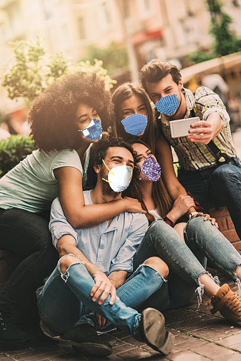
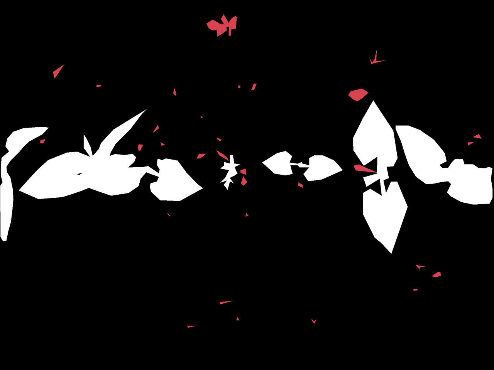
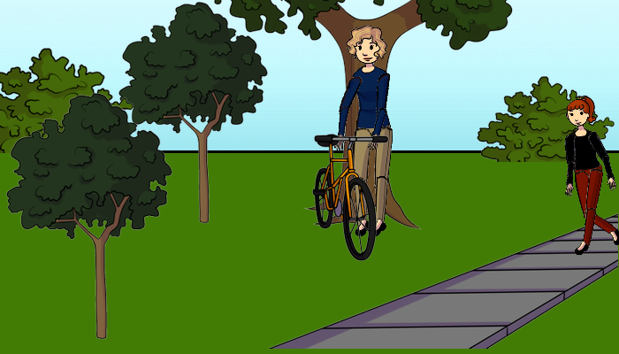
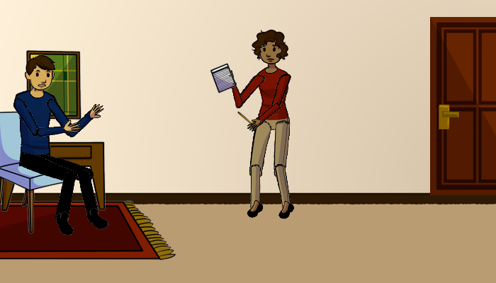

Artificial Neural Network and Deep Learning Competitions
========================================================

This repo contains the three competitions given in the Computer Science and Engineering
Master's Degree course [*Artificial Neural Networks and Deep Learning*
(054307 - A.Y. 2020/21)][course] of Politecnico di Milano.

Each competition covered a different topic of the course:

1. [Image Classification](#Image-Classification)
1. [Image Segmentation](#Image-Segmentation)
1. [Visual Question Answering](#Visual-Question-Answering)

Authors: [Leonardo Barilani][author-1], [Ozan Incesulu][author-2]

Image Classification
--------------------

> More about our solution in [README1](README1.md)

The goal of this competition was to build a multiclass classifier to solve an Image Classification problem. More specifically, we are required to identify people wearing masks and people who aren't.

Details:

* 3 different classes (e.g. everyone without mask, everyone with mask, somebody with mask)
* 5614 images in training set (with different dimension, but almost perfectly balanced between classes)
* 450 images for testing
* Evaluation: Multiclass Accuracy. Best result: 88% of accuracy

Image Segmentation
------------------

> More about our solution in [README2](README2.md)

The goal of this competition was to build several image segmentation models. More specifically, we are required to identify and discriminate between crop, soil and weed.

Details:

* Crops images, segmentation (crop/soil/weed)
* Number of Training images (per team per crop): 90
* Number of Testing images (per team per crop): 15
* Evaluation: IoU, Intersection over Union

Visual Question Answering
-------------------------

 **Main Model**

 **ImageAutoencoder**

 **Word2VecEncoder**

> More about our solution in [README3](README3.md)

The goal of this competition was to build a multiclass classifier to solve a Visual Question Answering problem. More specifically, we are required to answer 3 different kind of questions (yes/no questions, counting questions, other) with one out of 58 possible answers.

Details:

* 58 different classes (e.g. yes, no, red, 1, 2, 3, blue, nothing, left, right, etc.)
* 29333 images in training set
* 58832 questions in training set
* 6372 questions for testing
* Evaluation: Multiclass Accuracy. Best result: 49% of accuracy

    Q: How many bikes?!
    A: 1

    Q: Is the man's shirt blue?
    A: yes

---

*Copyright &copy; 2021 Leonardo Barilani & Ozan Incesulu.*

[course]: https://www4.ceda.polimi.it/manifesti/manifesti/controller/ManifestoPublic.do?EVN_DETTAGLIO_RIGA_MANIFESTO=evento&k_corso_la=481&k_indir=T2A&idItemOfferta=156912&idGruppo=4336&idRiga=271112&codDescr=054307&semestre=1&aa=2021&lang=IT&jaf_currentWFID=main
[author-1]: https://github.com/leonardobarilani
[author-2]: https://github.com/ozyinc/
